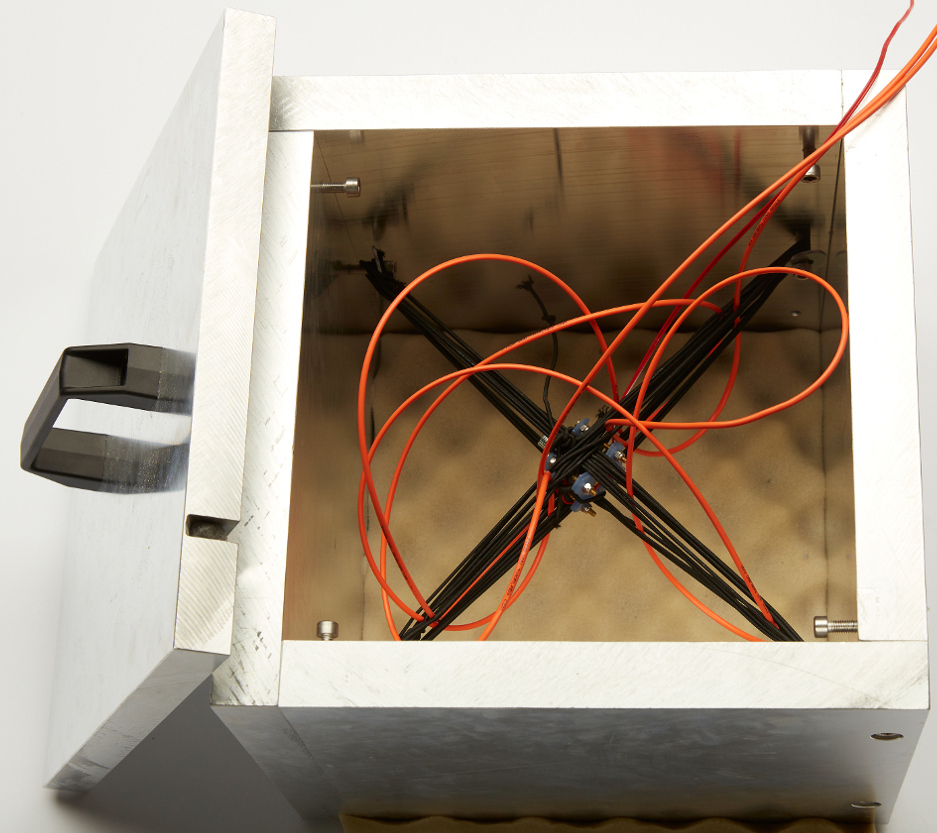
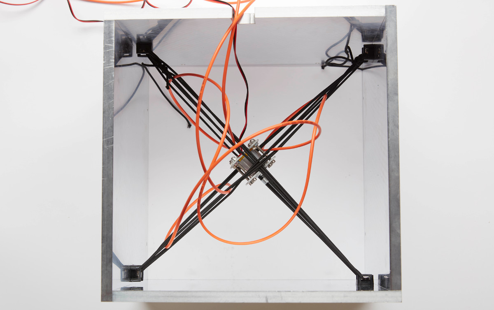

## Agitation module

The agitation module consists of an aluminium box in which a motor is suspended by elastic cords. Turning on the motor causes strong vibrations in the elastics. By intertwining a multimode optical fiber in the elastics, the agitation module provides an efficient way to suppress speckles. 

#### Parts

###### Agitation box

- [Machined box parts](AgitationBox)
- [3D printed handle](AgitationBox/Handle) x1
- [Cable tie base](https://www.thorlabs.de/thorproduct.cfm?partnumber=CMS010) x4
- [3 mm elastic cords](https://www.prym.com/en/elastic-cord-1.5mm-black-3m-971064?c=4315) x3

###### Motor

- [Motor v1](Motors/Motor_v1) (used in the publication), which features a cheap [vibration electric motor](http://www.sourcingmap.com/dc-156v-16500rpm-vibration-electric-micro-mini-motor-140-for-massager-p-811318.html) with limited lifetime.
  or

- [Motor v2](Motors/Motor_v2) (newer version), which features a more expensive [brushless motor](https://www.amazon.de/gp/product/B07777ZH3J/ref=ox_sc_act_title_1?smid=A3TCAMEHRX2HS1&psc=1) with increased durability.

  **We advise using version v2 of the motor system.**

All non-machined or 3D-printed part references can be found in [the parts folder](Parts). Each motor version requires specific parts, described in their subfolders.

#### Guidelines

In the manuscript, we used an heavy aluminium box (30 cm thick walls):

Here, we present a lighter version:

In their corresponding folders, you will find the guidelines regarding the mounting of the motor in its housing.

1. In [the box CAD folder](AgitationBox) you can find the blueprints for a lighter version of the agitation box. It consists of four panels screwed together with M4 screws. One of the panel has a dent to let the motor power supply cable and the optical fiber enter & leave the box. A lid is also described, with a [3D printed handle](AgitationBox_V2/Handle), in order to dampen the noise. The lid features four M3 screws at the corner to prevent it from sliding from the box.

   > Tip: We placed an egg box foam under the box to protect the floor and improve the noise dampening.

2. The box side panels each have an M4 thread to screw a cable tie base. The elastic cords can be tied to the handles of opposite base to create a diagonal bundle. **We advise creating a top and bottom bundles, along each diagonal, at least 5 cords strong each (as in the first picture).**

3. Mount the motor in its 3D-printed housing, either the [v1](Motors/Motor_v1) or the [v2](Motors/Motor_v2), according to its guidelines.

4. The v1 motor can simply be placed in between the elastic cord bundles, the bundles resting on a curved side of the housing (see pictures). The v2 motor can be secured to the elastic cord bundles with small cable ties going through its handles. 

5. In order to assert the efficiency of the speckle-reduction, image the optical fiber output on a camera (make sure you are focusing it properly) and turn on the motor. The speed of the motor (and therefore the supplied voltage), the tension of the cables and the mounting of the motor have an impact on the speckle-reduction efficiency.

Pictures credit: *EMBL/Marietta Schupp*