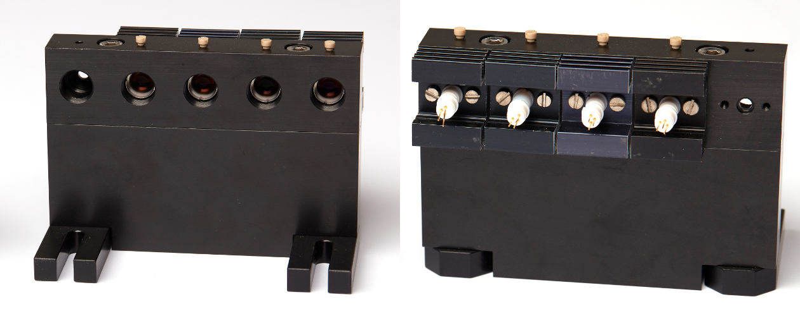

## Diodes mount

The diodes mount holds all four TO56-canned laser diodes and allows for efficient heat dissipation. The mount also contain the collimating lens and can be easily fixed on the laser engine breadboard.

#### Parts

- Laser diodes (see [the main optical path section](https://github.com/ries-lab/LaserEngine/tree/master/Laser_Engine))

- [Machined mount](Machined_Mount) x1

- BA1S/M base x2

- [Heat sinks with custom holes](Heat_sinks) x4

  > **Note**: The heat sinks were produced from a longer heat sink (SK 75 75, fischer elektronik). Each heat sink was cut to be 24 mm long in order to fit more easily side by side. 25 mm long heat sinks (SK 75 25, fisher elektronik) should also work.

- Thermal paste

- [Diode sockets](https://www.buerklin.com/de/Produkte/Aktive-Bauelemente/Zubeh%C3%B6r-f%C3%BCr-Halbleiter/Halbleiterfassungen/HALBL-FASSG-TF183/p/12B190) x4

- M2 plastic screws (> 13 mm) x4

- A240TM-A aspheric lens x4

  

  All non-machined part references can be found in [the parts folder](Parts). **Note that the BA1S/M and the lenses are present in the [Thorlabs part list](https://github.com/ries-lab/LaserEngine/tree/master/Laser_Engine/Parts/Thorlabs_parts_list).**
  
  > **Note**: The heat sinks were produced from a longer [heat sink (SK 75 75, fisher elektronik)](https://www.fischerelektronik.de/web_fischer/en_GB/heatsinks/A04/Extruded heatsinks for PCB mounting/$catalogue/fischerData/PR/SK75_75_/index.xhtml). Each heat sink was cut to be 24 mm long in order to fit more easily side by side. 25 mm long heat sinks (SK 75 25, fisher elektronik) should also work.
  
  

#### Guidelines

> **Note**: Laser diodes are sensitive to electrostatic discharges. If possible, use grounding when working with unmounted laser diodes.

1. Assemble the [laser diode mount](Machined_Mount) using long M6 screws. Then, with shorter ones, add the BA1S/M feet the mount base.
2. Apply a small amount of thermal paste on the sides of each laser diode (on the area where it is in contact with the mount). Then place the laser diodes in their aperture, center it and fix it by screwing on a heat sink. **Make sure that none of the laser diode pins are in contact with the heat sink to avoid shorting.** Test the diodes.
3. In order to collimate the diodes, first roughly screw the aspheric lenses in. Then turn on the diode you are collimating to a voltage above the lasing threshold (when the center linear profile starts becoming bright). **Make sure you are wearing proper laser light protections.**
4. Move the lens in or out until the laser central spot profile is not changing much during propagation over several meters. 
5. Fix the lens using the plastic screws. Avoid excessive tightening so as to not break the screw.
6. Repeat for all diodes, then move on to the laser engine alignment.

Pictures credit: *EMBL/Marietta Schupp*