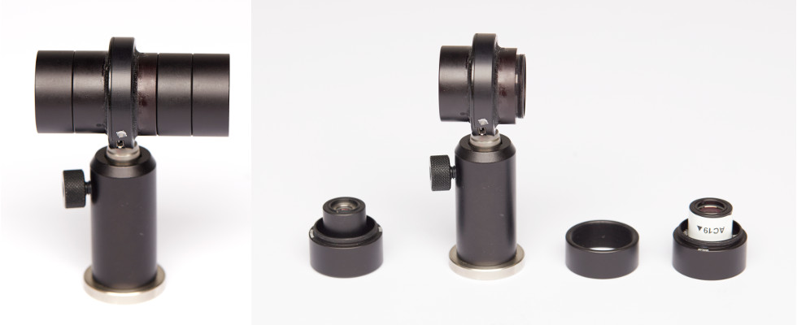

## Laser speckle-reducer assembly (optional)

The LSR system is aimed at further suppressing the laser speckles present in the output of a mutimode fiber-coupled 561 diode-pumped solid state laser. It is based on the LSR-3005-17S-VIS from Optotune, which features an oscillating membrane with diffusers. **We advise starting without this system and adding it only if the residual speckles are shown to be much stronger than those of the laser diodes.**

> Note that the LSR limits exposure times to >5 ms. 

#### Parts

Note that the Thorlabs parts used here are already present in the [Thorlabs cart corresponding to the laser engine with LSR system](https://github.com/ries-lab/LaserEngine/tree/master/Laser_Engine/Parts/Thorlabs_parts_list).

- [LSR-3005-17S-VIS, Optotune](https://www.optotune.com/products/laser-speckle-reducers/eap-lsr/lsr-3005-series) x1

- [gem561 laser](https://www.laserquantum.com/products/detail.cfm?id=65) x1

- UV glue

  

#### Guidelines

In order to obtain high quality speckle-reduction, the laser light must be focused on the LSR oscillating membrane and then collimated for fiber-coupling. Here, we describe the mounting and alignment of the lenses on the LSR (picture on the left).

We will call the side of the LSR with prints (and a countersink hole) the "exit" and the back-side the "entrance". 

1. Make sure that the 561 nm laser is collimated before aligning the LSR system and that it propagates along the holes on the table, according to [this schematic](https://github.com/ries-lab/LaserEngine/blob/master/Laser_Engine/Optical_path_with_Thorlabs_parts.pdf).

2. Glue the 10 mm lens on its lens adapter.

3. Place each lens, the 10 mm and the 19 mm, within a SM05V10 1/2" lens tube.

4. Lock a SM1A6 1/2" to 1" adapter close to the non-threaded side of two SM1L05 lens tube.

5. Insert the SM05V10 holding the lenses each within one of the 1/2" to 1" adapter (see left-most and right-most elements on the picture on the right above). The lenses should stick out on the threaded side of the lens tubes.

6. Glue a SM1M05 on the exit side of the LSR using UV glue. Do the same with a SM1L03 on the entrance side (thread pointing outward). They should be as centered as possible, in particular with respect to each other (they should be on the same axis). See the picture above (left).

7. Screw the LSR with post and post-holder (the post holder should be a standard post holder, as opposed to the pedestal post holder on the above picture) in position in the laser engine beam path.

8. Screw a SM1M05 on the entrance side of the LSR and the element including the 19 mm lens on the same SM1M05. 

9. **With the LSR turned off**, you should see speckles in the laser bream profile after the LSR. Move the lens inward or outward in order to maximize the size of the speckles in the profile. Once you find a position with large speckles, lock the SM05V10 in place using a lock ring.

   > **Note**: The "maximum size" of the speckles is somewhat subjective, look for the larger speckles in the profile and estimate a position where they seem bigger.

10. Unscrew the entrance elements and rotate the LSR 180 degrees on its base.

11. Repeat the procedure with the 10 mm lens until you maximize the speckles size.

12. Finally, rotate again the LSR and put back the lens tube system on the entrance side . Move the laser so that the beam goes again along the holes if it has moved.

13. Place the last mirror before the dichroic (see schematic).

Pictures credit: *EMBL/Marietta Schupp*