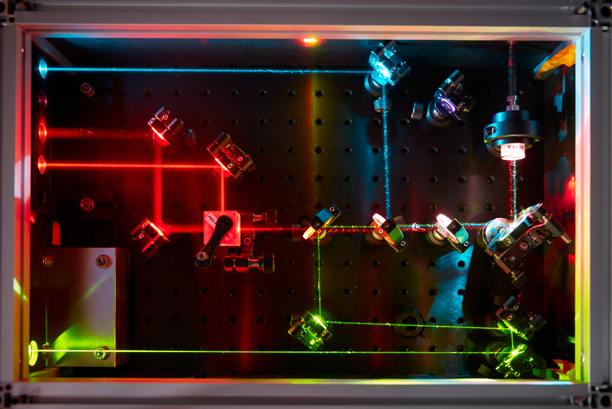

#  Open-source laser engine

Blueprints for a low-cost laser engine compatible with wide-field and localization microscopy. The laser engine is based on affordable, albeit powerful, laser diodes, a square multimode fiber and a speckle-reduction module.

### :information_source: ​How to navigate the repository

The repository contains the following complementary modules:

- [Agitation module](Agitation_Module): a box holding a motor suspended by elastic cords for speckle and noise reduction.
- [Laser diode electronics](Electronics): Electronics to control the power and triggering of the laser diodes from the computer.
- [Laser engine](Laser_Engine): plans and guidelines of the optical path. It contains several submodules:
  - [Laser diodes mount](Laser_Engine/Diodes_Mount): A machined mount to host the TO56-canned laser diodes.
  - [Enclosure](Laser_Engine/Enclosure): A simple box to protect the laser engine from dust and the users from laser light.
  - [**(Optional)** Speckle-reduction for a 561 nm laser](Laser_Engine/LSR): In case of further speckle-reduction needed for a dpss laser, we present an optional element to place in the beam path.

###  :warning: Safety warning​​s :warning:

- Always work with adequate laser light protection.
- The foam board used in the [enclosure](Laser_Engine/Enclosure) is a fire hazard when subjected to strong laser light. Make sure to place beam stops behind the dichroic mirrors and the polarization beam splitter so that no laser beam hits the foam board panels. 
- Building the [electronics](Electronics) oneself requires experience in soldering and electronics in general. Make sure you are working safely.

#### Cite us

 D Schroeder\*, J Deschamps\*, A Dasgupta, U Matti and J Ries, "*A cost-efficient open source laser engine for microscopy*", bioRxiv 796482; doi: https://doi.org/10.1101/796482

#### Contact

If you have any question, get in touch with the [Ries group.](https://rieslab.de/#contact)

#### License 

[GNU LGPL](license.txt)

#### Acknowledgements

The electronics was designed by Christian Kieser, Electronics workshop, EMBL.

Pictures credit: *EMBL/Marietta Schupp*
